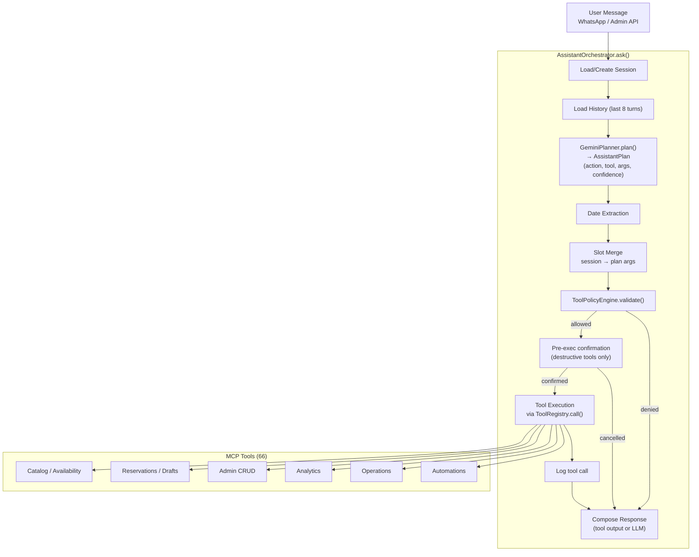

# AI Assistant Architecture

Gemini planificador + ToolPolicyEngine + MCP tools (66 tools).

Búsqueda en base de conocimiento (RAG): ver [RAG.md](RAG.md).

## Pipeline

## Components

| Component | Archivo | Responsabilidad |
|-----------|---------|----------------|
| `AssistantOrchestrator` | `assistant/orchestrator.py` | Loop principal, manejo de sesión, slots, confirmaciones |
| `GeminiPlanner` | `assistant/planner.py` | LLM call → `AssistantPlan` estructurado |
| `ToolPolicyEngine` | `assistant/policy.py` | Permisos por canal, autocorrección de tools |
| `ToolRegistry` | `mcp/registry.py` | Dict tool_name → callable |
| `GeminiProvider` | `providers/gemini_provider.py` | Cliente Gemini con fallback de keys y modelos |
| `ResponseComposer` | `assistant/response_composer.py` | Tool output → lenguaje natural |

## Policy model

Canal determina rol:

| Canal | Rol | Tools disponibles |
|-------|-----|------------------|
| `whatsapp` | client | CLIENT_TOOLS (14) |
| `mobile_api` | guide | CLIENT_TOOLS + GUIDE_TOOLS |
| `admin_api` | admin | CLIENT_TOOLS + GUIDE_TOOLS + ADMIN_TOOLS (55) |

Tools categorizadas como: READ, LIMITED_WRITE, WRITE, CRITICAL.
Critical tools siempre denegadas. High/Critical risk requiere humano.

## Confirmation gates

Tools destructivas requieren confirmación explícita del usuario antes de ejecutarse:
`admin_deactivate_*`, `admin_cancel_reservation`, `admin_confirm_reservation`,
`admin_approve_payment`, `admin_reject_payment_proof`, etc.

## Tool count by category

| Categoría | Count |
|-----------|-------|
| Catalog / Discovery | 4 |
| Knowledge / RAG | 1 |
| Availability & Schedules | 4 |
| Quote / Pricing | 1 |
| Client — Reservation Draft | 3 |
| Client — Reservations (CRUD) | 4 |
| Participant Forms | 2 |
| Guide (service log, incident) | 2 |
| Client — Self-service (cancel, update) | 3 |
| Admin — Experiences | 4 |
| Admin — Users | 4 |
| Admin — Schedules | 4 |
| Admin — Equines | 5 |
| Admin — Reservations | 4 |
| Admin — Participants | 2 |
| Admin — Payment Proofs | 5 |
| Admin — System/Config | 3 |
| Admin — Review Requests | 1 |
| Analytics | 4 |
| Operations (logistics, health, checklist) | 3 |
| Automations (birthday, anniversary, post-service) | 3 |
| **Total** | **64** |
