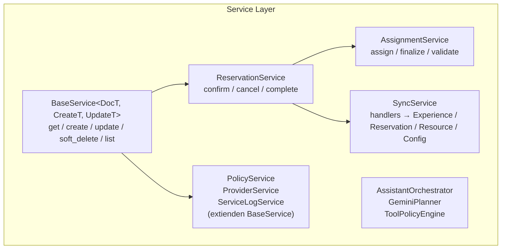
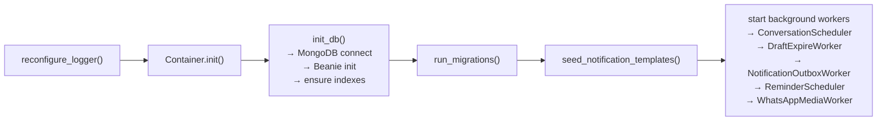

# Backend Architecture

FastAPI + Beanie (MongoDB). ~25 routers, ~25 servicios, ~30 documentos.

## Router tree (23 routers)

```mermaid
flowchart LR
  subgraph API["/api/v1"]
    health["health"]
    auth["auth"]
    users["users"]
    experiences["experiences"]
    schedules["schedules"]
    reservations["reservations"]
    payment_proofs["payment_proofs"]
    participants["participants"]
    participant_forms["participant_forms"]
    equines["equines"]
    saddles["saddles"]
    assignments["assignments"]
    config["config"]
    notifications["notifications"]
    sync["sync"]
    files["files"]
    logs["logs"]
    providers["providers"]
    policies["policies"]
    ask["ask"]
    admin_ask["admin_ask"]
    whatsapp["whatsapp"]
    diagnostics["diagnostics"]
  end
```



## Service layer



## DI Container

Manual container singleton (`app/core/di.py`). Inicializado en lifespan.

```python
class Container:
    _instance: Container | None = None

    def _init_services(self):
        self._services["reservation_service"] = ReservationService(...)
        self._services["config_service"] = ConfigService()

    @classmethod
    def init(cls) -> Container: ...
    @classmethod
    def get_instance(cls) -> Container: ...
```

Servicios inyectados via `Depends(get_xxx_service)` en endpoints.

## Document layer

Base class: `AuditDocument` con campos `version`, `created_at`, `updated_at`, `deleted_at`.

~30 documentos Beanie que mapean a colecciones MongoDB. Cada documento tiene:
- `class Settings: name = Collections.ENTITY`
- `IndexModel` en `Settings.indexes` para índices compuestos
- `field_validator` para reglas de negocio inline

Colecciones clave:
- `reservations` — ciclo de vida completo (estados, pagos, participantes)
- `experiences` — catálogo con pricing tiers, aliases, capacity
- `schedules` — fechas operativas con capacidad y slots
- `equines` / `saddles` — recursos operativos
- `assignments` — asignación equino+silla a reserva
- `sync_changes` — tracking de cambios para offline-first

## Lifespan (startup sequence)



## MCP Tools

**64 tools** MCP registradas en `app/ai/mcp/__init__.py`. Organizadas por categoría:
- Catalog/availability (experiences, schedules, pricing)
- Reservations (draft, payment proof, cancel, update)
- Admin CRUD (users, experiences, schedules, equines, reservations)
- Analytics (sales funnel, occupancy, workload)
- Operations (service logs, health events, checklists)
- Automations (birthday, anniversary)

## Migration system

```python
Migration(version="001", name="staff_to_guide", description="...")
```

- 3 migraciones formales en `app/migrations/versions/`
- Trackeadas en colección `migration_tracker`
- Idempotentes, fail-open
- Ejecutadas en startup via `run_migrations()`

## Seeds

CLI unificada: `python -m app.cli seed -t <name>`
6 seeds registrados: reproducible, equines, experiences, schedules, form-test, proof-file
