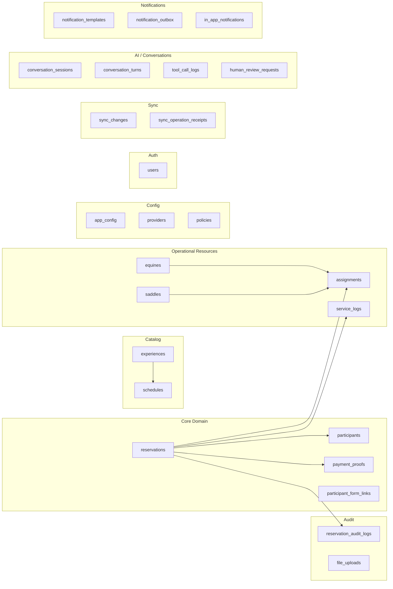

# Database Architecture

MongoDB via Beanie ODM. ~30 colecciones.

## Collections

## Key indexes

| Collection | Index | Type | Name |
|-----------|-------|------|------|
| experiences | `slug` | unique | — |
| saddles | `code` | unique | — |
| schedules | `(experience_id, date, start_time)` | unique | `uq_schedule_experience_date_start_time` |
| whatsapp_inbound_events | `wa_message_id` | unique | via app-level upsert |
| migration_tracker | `version` | unique | — |

## Migration system

Tres migraciones formales:

| Versión | Nombre | Descripción |
|---------|--------|-------------|
| 001 | `staff_to_guide` | Renombrar rol `staff` → `guide` |
| 002 | `backfill_sync_metadata` | Backfill metadata de sync |
| 003 | `backfill_schedule_is_active` | Backfill campo `is_active` en schedules |

Ejecutadas en startup via `app/migrations/runner.run_migrations()`.  
Tracked en collection `migration_tracker`.  
Idempotent, fail-open.

## Seed system

CLI: `python -m app.cli seed -t <name>`

| Seed | Propósito |
|------|-----------|
| `reproducible` | Datos base determinísticos |
| `equines` | Equinos de prueba |
| `experiences` | Experiencias del catálogo |
| `schedules` | Fechas operativas Q2 2026 |
| `form-test` | Datos para test de formularios |
| `proof-file` | Datos para test de comprobantes de pago |

## Soft delete

Todas las entidades usan soft delete:
- Campo `deleted_at: datetime | None = None`
- Queries filtran `deleted_at = None` por defecto
- `include_deleted: bool` para consultas admin
- `restore()` método que setea `deleted_at = None`

## Naming conventions

| Elemento | Regla | Ejemplo |
|----------|-------|---------|
| Collection | `snake_case`, plural | `reservation_audit_logs` |
| Field | `snake_case` | `participant_count` |
| ID ref | `{entity}_id` (string) | `reservation_id` |
| Boolean | `is_` prefix | `is_active`, `is_available` |
| Timestamps | `created_at`, `updated_at`, `deleted_at` | — |
| Versioning | `version: int = 1` | Optimistic concurrency |
