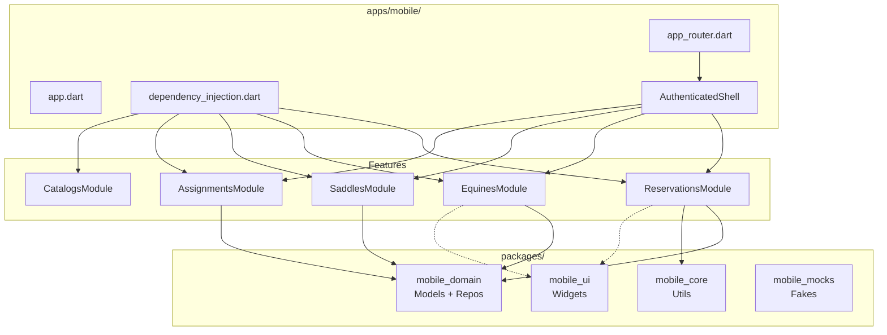

# Frontend Architecture

Flutter (Dart 3.11). Point of operation. Offline-first.

## Module structure

```
lib/
├── main.dart
├── bootstrap/           # App initialization
├── app/
│   ├── app.dart         # LaJuanaApp widget
│   ├── dependency_injection.dart  # createDependencies()
│   ├── navigation/      # AppRouter + shell controller
│   ├── shell/           # AuthenticatedShell with bottom nav
│   ├── theme/           # Light/dark ThemeData
│   └── widgets/         # Shared app-level widgets
└── features/
    ├── auth/            # Login, register, session
    ├── dashboard/       # Métricas operativas
    ├── reservations/    # CRUD reservas + payment proofs
    ├── equines/         # Perfil, timeline, health
    ├── saddles/         # Lista + CRUD
    ├── assignments/     # Board de asignaciones
    ├── catalogs/        # Experiencias, emergency contacts
    ├── participants/    # Participantes
    ├── providers/       # Proveedores
    └── configuration/   # Config, more flow
```

## Dependency graph



## Feature architecture (Clean Architecture)

```
feature/
├── domain/
│   ├── models/         # Domain entities (pure Dart)
│   └── repositories/   # Abstract interfaces
├── infrastructure/
│   ├── remote/         # ApiClient + DTOs
│   ├── local/          # SQLite data sources
│   ├── repositories/   # Impl: remote → cache fallback
│   └── mappers/        # DTO ↔ Domain
└── presentation/
    ├── controllers/    # ChangeNotifier + ActionState
    ├── screens/        # Full-page widgets
    └── widgets/        # Feature-specific widgets
```

## Module factory pattern

```dart
class ReservationsModule {
  factory ReservationsModule.create({
    required String baseUrl,
    required TokenStorage tokenStorage,
    required Future<bool> Function() refreshSession,
  }) {
    // Wire dependencies
    return ReservationsModule(
      repository: ...,
      listController: ...,
    );
  }
}
```

Cada feature tiene un módulo factory. Módulos creados en `createDependencies()`.

## Package dependency graph

```
mobile (app)
  ├── mobile_core    (utils: ActionState, formatting)
  ├── mobile_domain  (models + gen/ → auto-generated from OpenAPI)
  ├── mobile_ui      (widgets: AppButton, AppCard, etc.)
  └── mobile_mocks   (fakes para tests, dev-only)
```

## Key patterns

| Pattern | Archivo | Descripción |
|---------|---------|-------------|
| AppRouter | `app/navigation/app_router.dart` | `onGenerateRoute` con switch + auth guard |
| AppDependencies | `app/dependency_injection.dart` | Value object con todas las dependencias |
| AuthenticatedShell | `app/shell/authenticated_shell.dart` | Bottom nav con 5 tabs |
| AppTheme | `app/theme/app_theme.dart` | `ThemeData` light/dark + extensions |
| ThemeNotifier | `app/theme/app_theme_notifier.dart` | Toggle theme mode |
| StartupGate | `app/bootstrap/startup_gate.dart` | Auth state → route decision |
