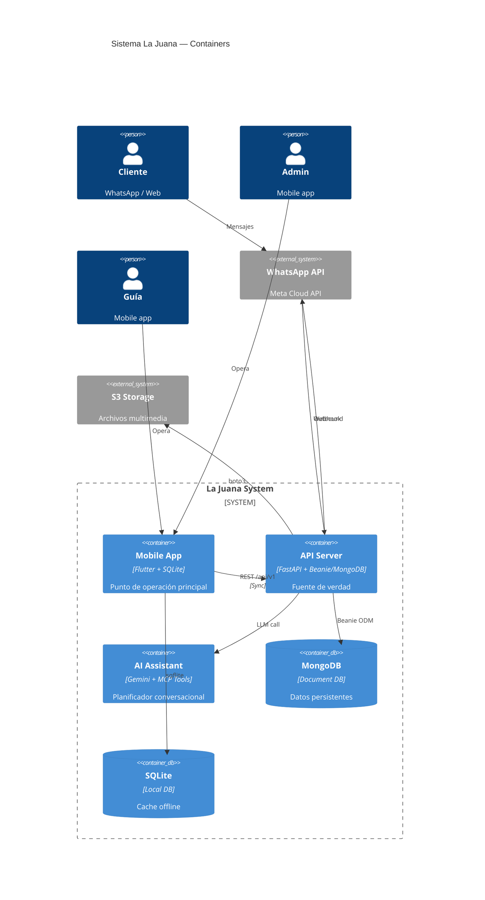
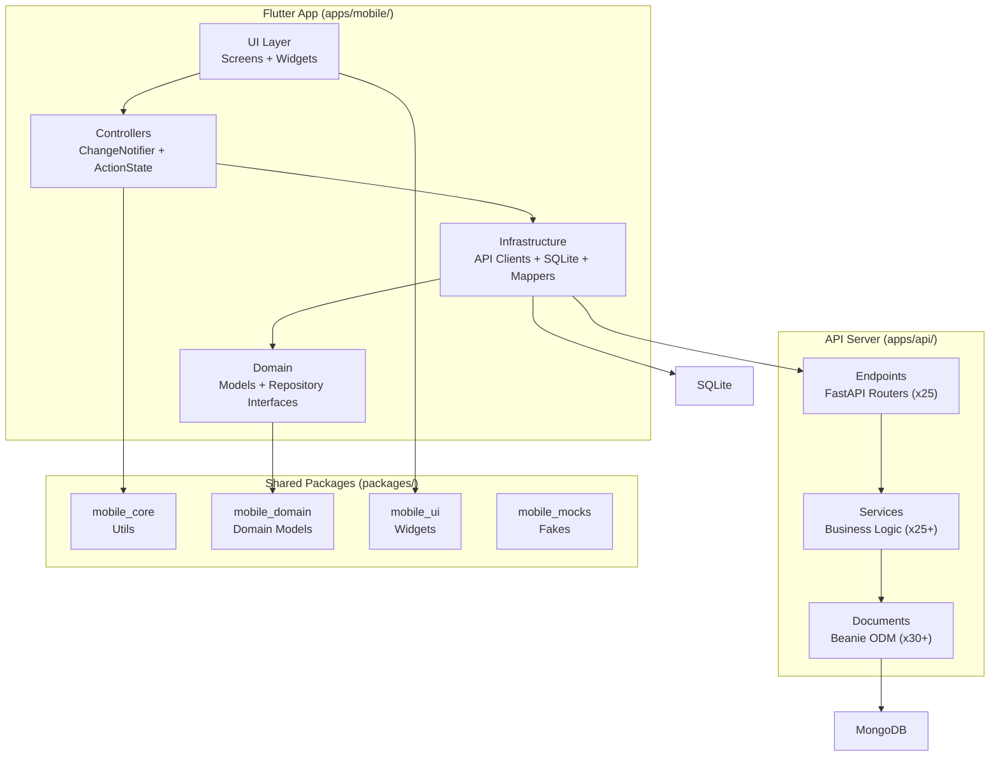
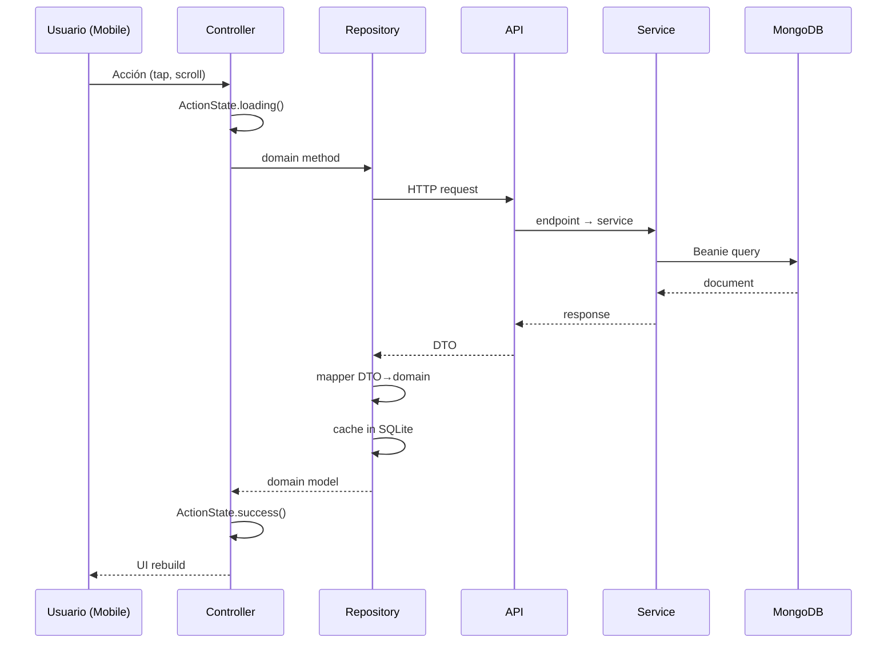

# System Overview



## Capas del sistema



## Flujo de datos principal



## Stack tecnológico

| Capa | Tecnología | Versión |
|------|-----------|---------|
| Backend framework | FastAPI | >=0.115 |
| ODM | Beanie (async MongoDB) | 1.x |
| Validación | Pydantic v2 | — |
| Auth | bcrypt + PyJWT (HS256) | — |
| AI | google-genai (Gemini 2.5) | — |
| Storage | boto3 (S3) o local | — |
| Backend tests | pytest + mongomock | — |
| Frontend | Flutter (Dart 3.11) | channel stable |
| State | ValueNotifier + ChangeNotifier | — |
| Local DB | sqflite (SQLite) | — |
| Icons | material_symbols_icons | — |
| Workspace | Dart pub workspace | — |

## Monorepo

```
/
├── apps/
│   ├── api/          # FastAPI (Python)
│   └── mobile/       # Flutter (Dart)
├── packages/
│   ├── mobile_core/  # Utilidades base
│   ├── mobile_domain/# Modelos + interfaces
│   │   └── gen/      # Generados desde OpenAPI
│   ├── mobile_ui/    # Widgets reusables
│   └── mobile_mocks/ # Fakes para testing
├── docs/             # Documentación
├── scripts/          # Scripts de utilidad
├── tools/            # Codegen
└── dev/playground/   # Dev screens (debug only)
```
