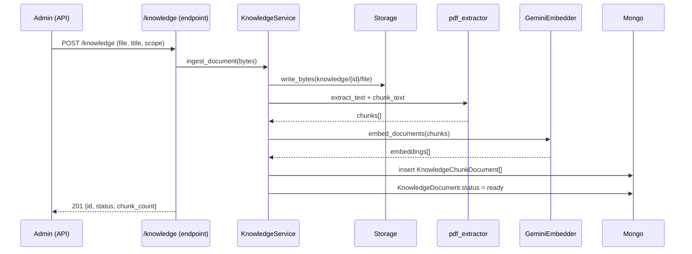

# RAG — Base de conocimiento

Búsqueda semántica sobre documentos cargados (PDF, texto, markdown) para que el
asistente responda preguntas abiertas sobre La Juana. El cliente sube y borra
documentos por API y el RAG **se adapta automáticamente**: al indexar o borrar,
los resultados de búsqueda cambian de inmediato.

## Decisiones de diseño

| Decisión | Elección | Por qué |
|----------|----------|---------|
| Embeddings | **Gemini** `text-embedding-004` | Reutiliza el SDK y las API keys ya usadas por el planner. Sin infra nueva. |
| Vector store | **MongoDB + similitud coseno en Python** | Funciona en cualquier Mongo (incluido local). No requiere Atlas `$vectorSearch`. |
| Arquitectura | Sobre el asistente actual (Gemini + MCP) | Coherente con la Fase B; sin LangGraph. |

> **Escalado**: la similitud coseno en Python es ideal para corpus pequeños/medianos
> (decenas a pocos miles de chunks). Para gran volumen, migrar a MongoDB Atlas
> `$vectorSearch` manteniendo la interfaz de `retriever.search_knowledge_chunks`.

## Flujo de ingesta



## Flujo de búsqueda (en el chat)

```
Usuario pregunta abierta  →  planner elige tool search_knowledge(query)
        ↓
retriever: embed_query(query) → carga chunks del scope public → cosine → top_k
        ↓
SearchKnowledgeOutput(snippets)  →  response_composer redacta la respuesta natural
```

El asistente **no inventa**: si `search_knowledge` no devuelve fragmentos, lo dice.

## Componentes

| Componente | Archivo | Responsabilidad |
|-----------|---------|----------------|
| `KnowledgeDocument` | `documents/knowledge_document.py` | Metadatos del documento (título, storage_key, scope, status, chunk_count) |
| `KnowledgeChunkDocument` | `documents/knowledge_chunk_document.py` | Chunk de texto + embedding + scope |
| `GeminiEmbedder` | `ai/rag/embeddings.py` | Embeddings Gemini con rotación de keys |
| `pdf_extractor` | `ai/rag/pdf_extractor.py` | Extracción (PDF/texto/markdown) + chunking con solapamiento |
| `retriever` | `ai/rag/retriever.py` | Similitud coseno + ranking top_k |
| `KnowledgeService` | `services/knowledge_service.py` | Ingesta, listado, reindexado y borrado |
| `search_knowledge` (tool) | `ai/mcp/tools/knowledge.py` | Tool MCP que consulta el RAG (scope public) |

## Endpoints (admin)

Requieren permisos `knowledge.read` / `knowledge.create` / `knowledge.delete`
(el rol `admin` los tiene todos).

| Método | Ruta | Propósito |
|--------|------|-----------|
| POST | `/knowledge` | Subir documento (multipart: `file`, `title`, `scope`) |
| GET | `/knowledge` | Listar documentos (filtro `scope` opcional) |
| GET | `/knowledge/{id}` | Ver metadatos / estado |
| POST | `/knowledge/{id}/reindex` | Reconstruir chunks desde el binario |
| DELETE | `/knowledge/{id}` | Borrar documento + chunks + binario |
| POST | `/knowledge/search` | Búsqueda semántica (debug, valida el RAG sin WhatsApp) |

## Modelo de datos

```
knowledge_documents          knowledge_chunks
─────────────────            ────────────────
id                  1 ─── *  source_document_id
title                        chunk_index
filename                     text
storage_key                  embedding: float[]
scope (public|ops)           scope (public|ops)
status                       title
chunk_count
```

Borrar un `knowledge_document` elimina sus `knowledge_chunks` y el binario del storage.

## Scopes

- **public**: visible para el chat de clientes (tool `search_knowledge`).
- **ops**: uso interno; la tool de clientes NO lo consulta.

## Configuración

| Variable | Default | Descripción |
|----------|---------|-------------|
| `RAG_ENABLED` | `true` | Habilita el RAG y la tool `search_knowledge` |
| `RAG_EMBEDDING_MODEL` | `text-embedding-004` | Modelo de embeddings de Gemini |
| `RAG_CHUNK_SIZE` | `1000` | Tamaño de chunk (caracteres) |
| `RAG_CHUNK_OVERLAP` | `150` | Solapamiento entre chunks |
| `RAG_SEARCH_TOP_K` | `4` | Nº de fragmentos recuperados |
| `RAG_MIN_SIMILARITY` | `0.55` | Umbral mínimo de similitud coseno |
| `RAG_MAX_DOCUMENT_BYTES` | `10485760` | Tamaño máximo de archivo (10 MB) |

Requiere `GEMINI_API_KEY` (la misma del planner). Tipos soportados: PDF,
`text/plain`, `text/markdown`.
