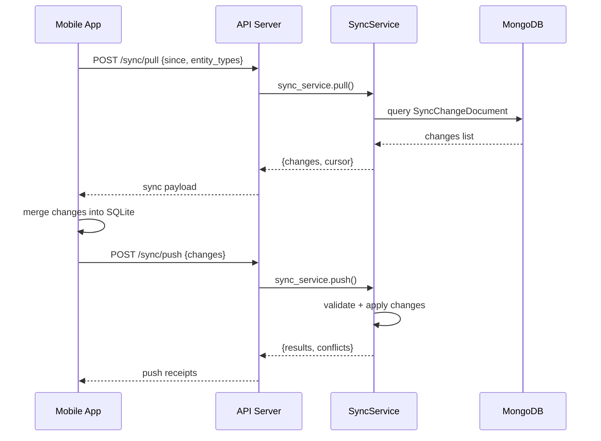

# Sync Protocol — Offline-first

## Flow



## Sync Handlers

SyncService dividido en 4 handlers especializados:

| Handler | Dependencias | Entidades |
|---------|-------------|-----------|
| `ExperienceSyncHandler` | experience, schedule | Catálogo |
| `ReservationSyncHandler` | reservation, participant, payment_proof, assignment, service_log | Operaciones |
| `ResourceSyncHandler` | provider, policy | Recursos |
| `ConfigSyncHandler` | config | Configuración |

## Key documents

- `SyncChangeDocument` — registro de cambio por entidad
- `SyncOperationReceiptDocument` — comprobante de operación (idempotencia)

## Offline-first mobile pattern

```dart
Future<List<ReservationListItem>> listReservations() async {
  try {
    final dtos = await _apiClient.listReservations();   // 1. Try remote
    await _localDataSource.cacheList(payloads);           // 2. Cache
    return mapped;
  } catch (_) {
    final cached = await _localDataSource.getCachedList(); // 3. Fallback to cache
    return mapped;
  }
}
```

Estrategia: **remote → cache → return**.  
On failure: **cache → return**.  
No cache: **rethrow**.
