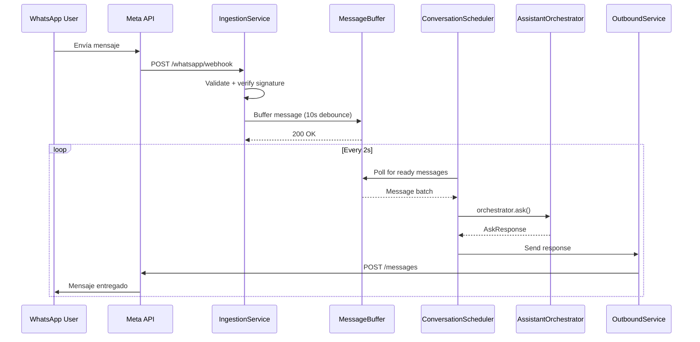
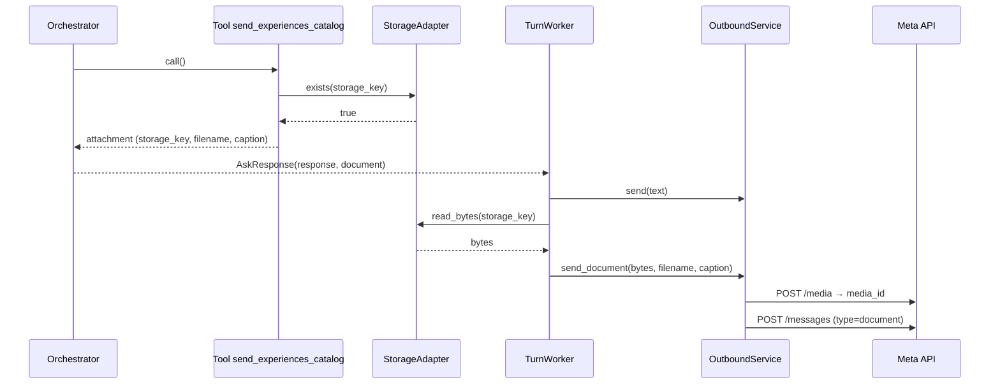

# WhatsApp Channel

Meta Cloud API. Webhook → Ingestion → AI Assistant → Outbound.

## Flow

## Components

| Componente | Archivo | Responsabilidad |
|-----------|---------|----------------|
| `IngestionService` | `channels/whatsapp/ingestion_service.py` | Recibir webhook, validar, encolar |
| `Normalizer` | `channels/whatsapp/normalizer.py` | Normalizar payload |
| `Parser` | `channels/whatsapp/parser.py` | Parsear payload |
| `Sender` | `channels/whatsapp/sender.py` | Enviar vía Meta API |
| `OutboundService` | `channels/whatsapp/outbound_service.py` | Orquestar envío |
| `MessageBufferService` | `conversations/services/message_buffer_service.py` | Debounce 10s, max 30s buffer |
| `ConversationScheduler` | `conversations/services/conversation_scheduler.py` | Background polling loop |

## Key features

- **Debounce**: mensajes entrantes se bufferan 10s (max 30s) antes de procesar
- **Lock service**: previene procesamiento concurrente del mismo conversation_id
- **Webhook verification**: firma Meta verificada
- **Media download**: worker async para descargar imágenes/documentos
- **Envío de documentos (PDF)**: el asistente puede adjuntar un PDF a la respuesta

## Envío de documentos (catálogo de experiencias)

El asistente puede enviar un documento PDF (p. ej. el catálogo de experiencias
muleras) cuando el usuario lo pide explícitamente ("mándame el catálogo",
"tienes un pdf", "me pasas el folleto").

### Cómo funciona

1. **Tool** `send_experiences_catalog` (cliente, read-only): no envía el binario;
   verifica que el PDF configurado exista en el storage (`StorageAdapter.exists`)
   y devuelve una referencia (`attachment`: `storage_key`, `filename`, `mime_type`,
   `caption`). Si el archivo no existe → `catalog_available=false` y el asistente
   ofrece una alternativa (p. ej. `list_experiences`).
2. **Orchestrator**: traslada el `attachment` del `tool_output` al campo
   `AskResponse.document` (`OutboundDocumentRef`). El asistente sigue siendo
   agnóstico del canal: solo señala *qué* adjuntar, no *cómo* enviarlo.
3. **Worker** (`ConversationTurnWorker`): tras enviar el texto, si hay
   `response.document`, lee el binario del storage y llama a
   `OutboundService.send_document`.
4. **OutboundService.send_document**: flujo de la Cloud API en dos pasos —
   `POST /{phone_id}/media` (sube el binario, obtiene `media_id`) y luego
   `POST /{phone_id}/messages` con `type=document`. Así no se depende de una URL
   pública del archivo (el storage puede ser local).

### Configuración

| Variable | Default | Descripción |
|----------|---------|-------------|
| `WHATSAPP_EXPERIENCES_CATALOG_ENABLED` | `true` | Habilita/deshabilita el envío del catálogo |
| `WHATSAPP_EXPERIENCES_CATALOG_STORAGE_KEY` | `catalogs/experiencias-muleras.pdf` | Ruta del PDF en el storage |
| `WHATSAPP_EXPERIENCES_CATALOG_FILENAME` | `Experiencias-La-Juana.pdf` | Nombre con el que llega al usuario |
| `WHATSAPP_EXPERIENCES_CATALOG_CAPTION` | `Catálogo de experiencias muleras…` | Texto que acompaña el documento |
| `WHATSAPP_EXPERIENCES_CATALOG_MIME_TYPE` | `application/pdf` | MIME del documento |

> **Setup**: coloca el PDF del cliente en el storage bajo la `STORAGE_KEY`
> configurada. Con `LocalStorageAdapter` (default) es `./storage/catalogs/experiencias-muleras.pdf`.
> El envío real requiere `WHATSAPP_SEND_ENABLED=true` y credenciales válidas.

## Endpoints

| Método | Ruta | Propósito |
|--------|------|-----------|
| GET | `/whatsapp/webhook` | Meta verification |
| POST | `/whatsapp/webhook` | Recibir mensajes entrantes |
