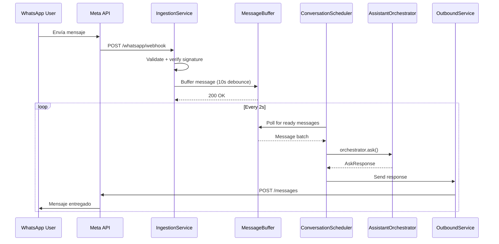

# WhatsApp Channel

Meta Cloud API. Webhook → Ingestion → AI Assistant → Outbound.

## Flow

## Components

| Componente | Archivo | Responsabilidad |
|-----------|---------|----------------|
| `IngestionService` | `channels/whatsapp/ingestion_service.py` | Recibir webhook, validar, encolar |
| `Normalizer` | `channels/whatsapp/normalizer.py` | Normalizar payload |
| `Parser` | `channels/whatsapp/parser.py` | Parsear payload |
| `Sender` | `channels/whatsapp/sender.py` | Enviar vía Meta API |
| `OutboundService` | `channels/whatsapp/outbound_service.py` | Orquestar envío |
| `MessageBufferService` | `conversations/services/message_buffer_service.py` | Debounce 10s, max 30s buffer |
| `ConversationScheduler` | `conversations/services/conversation_scheduler.py` | Background polling loop |

## Key features

- **Debounce**: mensajes entrantes se bufferan 10s (max 30s) antes de procesar
- **Lock service**: previene procesamiento concurrente del mismo conversation_id
- **Webhook verification**: firma Meta verificada
- **Media download**: worker async para descargar imágenes/documentos

## Endpoints

| Método | Ruta | Propósito |
|--------|------|-----------|
| GET | `/whatsapp/webhook` | Meta verification |
| POST | `/whatsapp/webhook` | Recibir mensajes entrantes |
