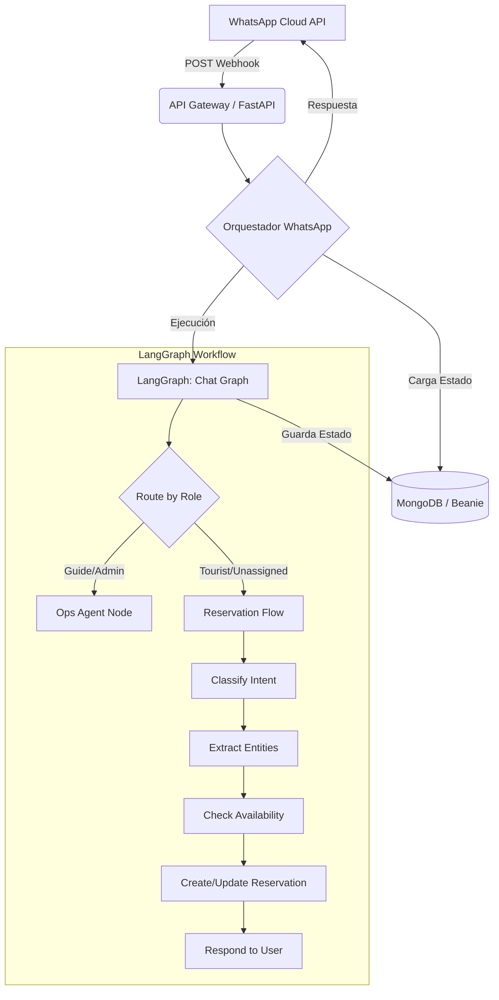

# Arquitectura del Chatbot: La Juana

La arquitectura se basa en un diseño de **Grafo de Estados (LangGraph)** orquestado por **FastAPI**, que separa las intenciones operativas (personal interno) de las de reserva y consulta (público general).

## 1. Diagrama de Flujo de Webhooks



## 2. Componentes Críticos

### Orquestador de WhatsApp
Este componente es el punto de entrada para los mensajes de WhatsApp. Su responsabilidad es:
1.  **Persistencia Transaccional**: Utiliza un `BeanieConversationCheckpointer` para cargar y guardar el historial de la conversación en MongoDB usando el `wa_user_id` como clave.
2.  **Detección de Intención Rápida**: Identifica palabras clave de reserva antes de entrar al grafo para optimizar el contexto.
3.  **Invocación del Grafo**: Ejecuta `graph.ainvoke()` con el estado inicial consolidado.

### Grafo de Estados
Define la lógica de navegación basada en nodos en `apps/api/app/agents/graph.py`:
-   **Ops Agent**: Conectado a herramientas de gestión de equinos, sillas y bitácora.
-   **Reservation Flow**: Un pipeline lineal que procesa el mensaje desde la clasificación de intención hasta la sincronización de conocimiento (RAG).

## 3. Implementación del Webhook (Resumen de Código)

El flujo central de recepción de mensajes en el endpoint `/api/v1/whatsapp/chat` dentro de [apps/api/app/api/endpoints/whatsapp.py](apps/api/app/api/endpoints/whatsapp.py):

```python
@router.post("/chat", response_model=ChatResponseSchema)
async def post_whatsapp_message(payload: WhatsAppChatRequestSchema):
    conversation_id = payload.conversation_id or payload.wa_user_id
    user_id = payload.wa_user_id

    # 1. Recuperar historial y estado previo
    restored = await checkpointer.load(conversation_id=conversation_id, user_id=user_id)
    
    # 2. Preparar estado para LangGraph
    initial_state = {
        "messages": list((restored or {}).get("messages", [])) + [HumanMessage(content=payload.message)],
        "source": "whatsapp",
        "whatsapp_phone": payload.wa_user_id,
        "booking_intent": _looks_like_booking_intent(payload.message),
        # ... otros campos de estado extraídos
    }

    # 3. Ejecutar orquestador inteligente
    result = await graph.ainvoke(initial_state)
    
    # 4. Extraer última respuesta de la IA
    reply = _latest_ai_reply(result.get("messages", []))

    # 5. Persistir nuevo estado
    await checkpointer.save(conversation_id=conversation_id, user_id=user_id, state=result)

    return ChatResponseSchema(reply=reply, ...)
```

## 4. Lógica de Negocio en el Nodo de Operaciones

El agente operativo definido en [apps/api/app/agents/nodes.py](apps/api/app/agents/nodes.py) traduce lenguaje natural de los guías en acciones del sistema:

```python
async def ops_agent_node(state: GraphState, deps: NodeDependencies, config: RunnableConfig):
    # Configura herramientas de administración (Equinos, Reservas, Sillas)
    tools = create_ops_tools(
        ops_service=deps.ops_service,
        reservation_service=deps.reservation_service,
        # ...
    )
    llm_with_tools = deps.chat_model.bind_tools(tools)
    
    # El prompt instruye al LLM a actuar como traductor administrativo
    system_prompt = SystemMessage(content="Eres el agente operativo... traduces instrucciones naturales a llamadas estructuradas.")
    
    messages = [system_prompt] + state.get("messages", [])
    response = await llm_with_tools.ainvoke(messages, config)
    return {"messages": [response]}
```

## 5. Decisiones Arquitectónicas Clave

1.  **Stateful Conversations**: A diferencia de un chatbot tradicional, este mantiene un `extracted_data` persistente que "recuerda" la fecha, experiencia y pax que el usuario mencionó en mensajes anteriores.
2.  **Fallback de Respuesta**: Incluye limpieza de tokens técnicos (como `</thought>`) para asegurar que el usuario reciba texto humanizado.
3.  **Separación de Roles**: El grafo utiliza `route_initial_by_role` para bifurcar el tráfico inmediatamente, protegiendo las herramientas de administración.
