# Mobile App Architecture

## Overview

La Juana mobile follows **Clean Architecture** per feature, organized in three layers: **domain**, **infrastructure**, and **presentation**. The app is offline-first and mobile-first, with the backend serving as the source of truth for critical validations.

## Layer Structure per Feature

```
lib/features/<feature>/
├── domain/           # Entities, repositories (abstract), value objects
│   ├── models/       # Domain models (e.g., Equine, Schedule)
│   ├── repositories/ # Abstract repository interfaces
│   └── enums/        # Domain enums (e.g., LocalAuthState)
├── infrastructure/   # Concrete implementations, API clients, DB, mappers
│   ├── remote/       # API clients, DTOs
│   ├── local/        # SQLite data sources, local records
│   ├── repositories/ # Repository implementations (remote + cache)
│   └── mappers/      # DTO ↔ Domain ↔ ViewModel mappings
└── presentation/     # UI layer: screens, controllers, widgets
    ├── controllers/  # ChangeNotifier controllers (state machines)
    ├── screens/      # Full-page widgets
    ├── widgets/      # Feature-specific reusable widgets
    └── models/       # View models (presentation-only data classes)
```

### Examples of features following this structure:
- **auth** — `domain/auth_repository.dart`, `infrastructure/remote/auth_api_client.dart`, `presentation/auth_controller.dart`
- **equines** — `domain/models/equine.dart`, `infrastructure/mappers/equine_mapper.dart`, `presentation/controllers/equines_controller.dart`
- **saddles** — `domain/repositories/saddles_repository.dart`, `infrastructure/repositories/saddles_repository_impl.dart`, `presentation/controllers/saddles_list_controller.dart`
- **catalogs** — `domain/experience.dart`, `data/catalogs_repository.dart`, `presentation/controllers/experiences_controller.dart`
- **reservations** — `domain/reservations_repository.dart`, `infrastructure/repositories/reservations_repository_impl.dart`, `presentation/controllers/reservations_list_controller.dart`

## Module System

Modules are factory classes that wire up feature dependencies at the app level. Each module provides a clean interface for the shell to consume.

| Module | File | Exposes |
|--------|------|---------|
| `CatalogsModule` | `features/catalogs/catalogs_module.dart` | `repository`, `experiences`, `schedules`, `reservationRules`, `emergencyContacts` |
| `ReservationsModule` | `features/reservations/reservations_module.dart` | `repository`, `listController` |
| `SaddlesModule` | `features/saddles/saddles_module.dart` | `repository`, `listController` |
| `AssignmentsModule` | `features/assignments/assignments_module.dart` | `repository` |

Modules are created via static `create()` factory methods that receive `baseUrl`, `tokenStorage`, and `refreshSession`, allowing test injection via `http.Client?`.

## Key Folders

```
lib/
├── main.dart                    # Entry point → delegates to bootstrap
├── bootstrap/bootstrap.dart     # WidgetsFlutterBinding, API base URL, runApp
├── app/
│   ├── app.dart                 # LaJuanaApp StatefulWidget (theme, DI, router)
│   ├── dependency_injection.dart  # createDependencies() + AppDependencies
│   ├── api_base_url.dart        # Resolves backend URL per platform
│   ├── navigation/
│   │   ├── app_router.dart      # onGenerateRoute switch
│   │   └── shell_navigation_controller.dart  # Tab state management
│   ├── shell/
│   │   ├── authenticated_shell.dart   # Bottom-nav scaffold with 5 tabs
│   │   └── widgets/shell_status_region.dart  # Status banners
│   ├── bootstrap/
│   │   ├── startup_gate.dart          # Auth gate + bootstrap trigger
│   │   ├── startup_orchestrator.dart  # Single entry for bootstrap logic
│   │   ├── startup_state.dart         # StartupPhase enum
│   │   └── dev_loader_screen.dart     # Widget museum (dev only)
│   ├── theme/                  # Delegates to mobile_ui package
│   ├── widgets/                # Delegates to mobile_ui package
│   └── utils/                  # File saver, etc.
├── features/                   # One subfolder per feature (see above)
└── dev/playground/             # Dev-only screens (release-guarded)
```

## Bootstrap Sequence

```mermaid
flowchart LR
    A[main] --> B[bootstrap]
    B --> C[WidgetsFlutterBinding.ensureInitialized]
    C --> D[resolveApiBaseUrl]
    D --> E[runApp LaJuanaApp]
    E --> F[_initDependencies → createDependencies]
    F --> G[AppRouter created]
    G --> H[StartupGate rendered]
    H --> I[StartupOrchestrator.runBootstrap]
    I --> J[authController.appStarted]
    J --> K[Resolver: sessionGate → login or /home]
```



Steps:
1. `main()` calls `bootstrap()`.
2. `bootstrap()` ensures bindings, resolves the API base URL, and runs `LaJuanaApp`.
3. `LaJuanaApp.initState` calls `createDependencies()` to wire up all dependencies (auth, catalogs, reservations, saddles, assignments, equines).
4. The initial route `AuthRoutes.sessionGate` renders `StartupGate`.
5. `StartupGate.initState` calls `StartupOrchestrator.runBootstrap()` which delegates to `authController.appStarted()`.
6. `appStarted()` checks network status, attempts session restore, and resolves the target route (login or home).
7. `AuthRoutes.home` renders `AuthenticatedShell` with bottom navigation.

## Dependency Injection

DI is manual (no DI framework). All wiring lives in `app/dependency_injection.dart`.

### `AppDependencies` (value object)

Holds all initialized singletons:
- `AuthController`
- `AuthApiClient`
- `CatalogsModule`, `ReservationsModule`, `SaddlesModule`, `AssignmentsModule`
- `EquineRepository`

Created once in `LaJuanaApp.initState`, passed to `AppRouter`, then to `AuthenticatedShell`.

### `createDependencies(String apiBaseUrl)`

Returns `Future<AppDependencies>`. Wires in order:

1. **Auth chain**: `AuthApiClient` → `AuthDatabase` → `SessionLocalDataSource` → `UserLocalDataSource` → `AuthRepositoryImpl`
2. **Connectivity**: `ConnectivityPlusService` + `HttpBackendReachabilityService` → `NetworkStatusResolver`
3. **AuthController**: combines repository + network resolver
4. **Catalogs**: `CatalogsSyncApi` + `CatalogsDatabase` → `CatalogsRepository` → `CatalogsModule`
5. **Core modules** (reservations, saddles, assignments): each creates API client + repository + controller via `factory .create()` constructor
6. **Equines**: `EquinesApiClient` + `EquinesDatabase` → `EquineRepositoryImpl`

## Package Dependencies

The app depends on four internal packages (declared in `pubspec.yaml` via `path:`):

| Package | Path | Contents |
|---------|------|----------|
| `mobile_core` | `packages/mobile_core/` | Shared utilities: `ActionState<T>`, date utils, formatting, `parseInt`/`parseDouble`. No Flutter dependency. |
| `mobile_domain` | `packages/mobile_domain/` | Domain entities and repository interfaces: `ReservationListItem`, `Equine`, `SaddleListItem`, `AssignmentBoard`. Includes code-generated models under `src/gen/`. |
| `mobile_ui` | `packages/mobile_ui/` | Reusable UI widgets, theme system (`AppColors`, `AppTextTheme`, `AppRadii`), design tokens. Pure presentation — no business logic. |
| `mobile_mocks` | `packages/mobile_mocks/` | Fake repositories for testing: `FakeReservationsRepository`. |

External key dependencies:
- **`sqflite`** — Local SQLite database (auth, catalogs, equines, reservations)
- **`http`** — HTTP client for API calls
- **`connectivity_plus`** — Network link monitoring
- **`material_symbols_icons`** — Icon set
- **`flutter_svg`** — SVG rendering for branding
