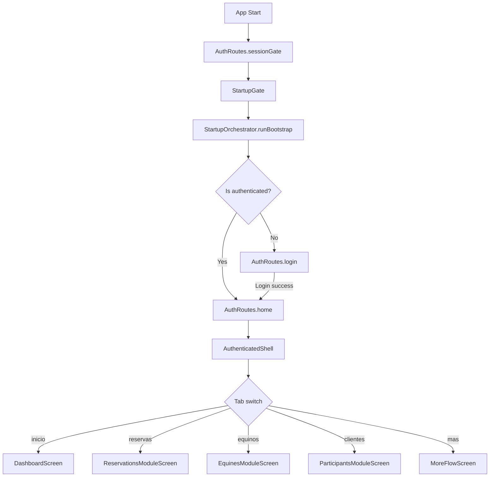

# Routing

Routing uses Flutter's **named routes** with a single `onGenerateRoute` switch via `AppRouter`. There is no Navigator 2.0 / GoRouter.

## Route Table

Route constants are defined in `AuthRoutes` (`features/auth/presentation/auth_routes.dart`):

| Route constant | Path | Screen | Auth Required |
|---------------|------|--------|---------------|
| `sessionGate` | `/session-gate` | `StartupGate` | No |
| `login` | `/login` | `LoginScreen` | No |
| `register` | `/register` | `RegisterScreen` | No |
| `home` | `/home` | `AuthenticatedShell` | Yes (redirects to login if not) |
| `sessionView` | `/session-view` | `SessionViewScreen` | Yes |
| `changePassword` | `/change-password` | `ChangePasswordScreen` | Yes |
| `devLoader` | `/dev/loader` | `DevWidgetCatalogScreen` | Dev only |
| `widgetMuseum` | `/dev/widgets` | `WidgetMuseumPlaceholder` | Dev only |

## `AppRouter` (`app/navigation/app_router.dart`)

`AppRouter` is a standalone class extracted from the app widget lifecycle. It receives `AppDependencies` and implements `onGenerateRoute`.

```dart
class AppRouter {
  AppRouter(this.dependencies);

  final AppDependencies dependencies;

  Route<dynamic> onGenerateRoute(RouteSettings settings) {
    final routeName = settings.name ?? AuthRoutes.sessionGate;
    final canAccessAuthenticated = _isAuthenticated();

    switch (routeName) {
      case AuthRoutes.sessionGate:
        return MaterialPageRoute(builder: (_) => StartupGate(...));
      case AuthRoutes.login:
        return MaterialPageRoute(builder: (_) => LoginScreen(...));
      case AuthRoutes.home:
        return MaterialPageRoute(
          builder: (_) => canAccessAuthenticated
              ? AuthenticatedShell(...)
              : LoginScreen(...),
        );
      // ...
    }
  }
}
```

### Auth Guard

Authentication is checked inline via `_isAuthenticated()`:

```dart
bool _isAuthenticated() {
  final state = dependencies.authController.authState;
  return state == LocalAuthState.signedInVerified ||
      state == LocalAuthState.signedInLocalUnverified;
}
```

Routes `/home`, `/session-view`, and `/change-password` redirect to `LoginScreen` if not authenticated.

## `StartupGate` — Auth Bootstrap Gate

`StartupGate` (`app/bootstrap/startup_gate.dart`) is the **initial route** (`AuthRoutes.sessionGate`). It:

1. Triggers `StartupOrchestrator.runBootstrap()` which calls `authController.appStarted()`.
2. While bootstrapping, renders a branded loading screen (`"LA JUANA"` + spinner + status badge).
3. After bootstrap completes, resolves the target route via `_resolveTargetRoute()`:
   - `signedInVerified` / `signedInLocalUnverified` → `/home`
   - `signedOut` / `refreshRequired` / `invalid` → `/login`
4. Uses `pushReplacementNamed` to navigate (avoids back-navigation to the gate).

## `AuthenticatedShell` — Bottom Navigation Shell

`AuthenticatedShell` (`app/shell/authenticated_shell.dart`) is the main authenticated scaffold with 5 tabs:

| Tab | `AppNavItem` | Screen |
|-----|-------------|--------|
| Inicio | `inicio` | `DashboardScreen` |
| Reservas | `reservas` | `ReservationsModuleScreen` |
| Equinos | `equinos` | `EquinesModuleScreen` |
| Clientes | `clientes` | `ParticipantsModuleScreen` |
| Más | `mas` | `MoreFlowScreen` |

### Tab State Management

Each tab has its own `Navigator` with a `GlobalKey<NavigatorState>`, enabling **per-tab navigation stacks**:

```dart
final Map<AppNavItem, GlobalKey<NavigatorState>> _navigatorKeys = {};
final Set<AppNavItem> _visitedTabs = {};
```

- `_visitedTabs` tracks which tabs have been visited (lazy initialization).
- `Offstage` + `TickerMode` preserves tab state when switching.
- `ShellNavigationController` (`app/navigation/shell_navigation_controller.dart`) is a `ChangeNotifier` that holds the current tab index. Changes trigger rebuild via `Listenable.merge([widget.authController, _shellNav])`.

### Status Region

Above the main content, `ShellStatusRegion` renders conditional banners for:
- No network link (offline)
- Backend unreachable
- Mobile data (info)
- Pending sync changes
- Local session mode
- Session requires validation

### Reconnect Overlay

When the app detects it has a network link but the backend was unreachable and now might be available, it shows a reconnection overlay with a spinner and "Reconectando sesion..." message.

## Module-Level Sub-Routing

Modules that contain multiple pages use their own navigation within the tab's `Navigator`. For example:

- **Catalogs**: `CatalogsHomePage` → `ExperiencesPage` / `SchedulesPage` / `ReservationRulesPage` / `EmergencyContactsPage`
- **Experiences**: `ExperiencesPage` → `ExperienceDetailPage` → `ExperienceFormPage`
- **Schedules**: `SchedulesPage` → `ScheduleDetailPage` → `ScheduleFormPage`

These are pushed onto the tab's own `Navigator` stack via `Navigator.of(context).push(...)` within the same tab.

## Deferred Imports for Dev Screens

Dev/playground routes use **deferred imports** to tree-shake development code from release builds:

```dart
import 'package:mobile/app/bootstrap/dev_loader_screen.dart' deferred as dev;
import 'package:mobile/app/bootstrap/dev/widget_museum_placeholder.dart'
    deferred as dev_ph;
```

The `_devScreen()` method only resolves routes in non-release builds (`kReleaseMode` guard):

```dart
Widget? _devScreen(String routeName) {
  if (kReleaseMode) return null;
  dev.loadLibrary();
  dev_ph.loadLibrary();
  switch (routeName) {
    case AuthRoutes.devLoader:
      return dev.DevWidgetCatalogScreen();
    case AuthRoutes.widgetMuseum:
      return dev_ph.WidgetMuseumPlaceholder();
    default:
      return null;
  }
}
```

## Route Flow Diagram


